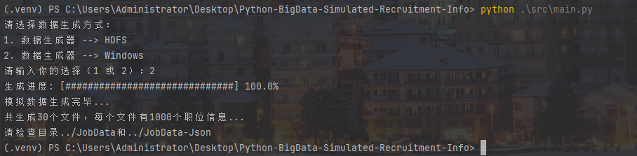
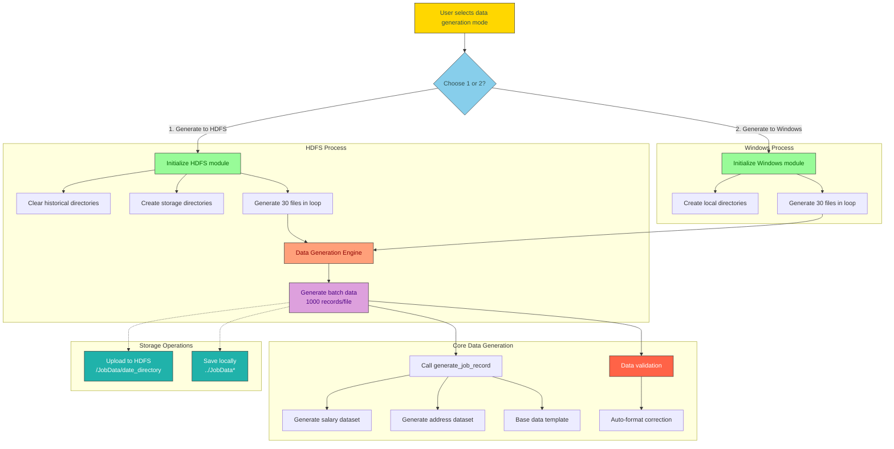

<div align="center">
  <h1>🔥 BigData-Simulated-Recruit</h1>
  <p>Big Data Industry Recruitment Data Generator</p>
  
    <!-- 更新许可证徽章 -->
  
</div><br/>


> 🚀 **Introduction**: Highly simulated recruitment data generator for big data industry | Supports stress testing/algorithm training/industry research  
> 📅 **Version**: v1.0.0 | Last Updated: 2025-03-21  
> 👨 **Developer**: D.C.Y. | © 2025 D.C.Y. Licensed under [CC BY-NC 4.0](https://creativecommons.org/licenses/by-nc/4.0/)



### 🌟 Core Features

- **Full-dimensional Data Simulation**  
  📊 Covers 20+ key dimensions including company info/job requirements/salary systems/tech tags  
  🏙️ Supports feature distribution across tier 1/2/3 cities  
  💰 Dynamic salary model (referencing "2025 China Compensation White Paper")

- **Industry-standard Specifications**  
  ✅ GB/T 35295-2017 Big Data Terminology Standard  
  📜 JSON Schema Draft-07 Data Structure  
  🧮 <5% data missing rate simulating real-world scenarios

- **High-performance Generation Engine**  
  ⚡ Single file generation <500ms | 30MB data volume  
  🧠 Memory-optimized algorithms (peak <50MB)  
  🔄 Horizontally scalable to million-level datasets

### 🛠️ Quick Start

- **Environment Setup**
    ```bash
    # Clone repository
    git clone https://github.com/dcyyd/BigData-Simulated-Recruit.git
    
    # Enter project directory
    cd BigData-Simulated-Recruit/src
    
    # Create virtual environment
    python -m venv xenv
    
    # Activate environment
    source xenv/bin/activate  # Linux/Mac
    xenv\Scripts\activate.bat  # Windows
    
    # Install dependencies
    pip install -r requirements.txt
    ```

- **Data Generation**
    ```bash
    # Run generator
    python generate_data_to_windows.py
    ```
- **Sample Output**
    ```markdown
    Data generation completed. 30 files generated, each containing 1000 records
    ```

- **Packaging the Project**
    ```bash
    # Install packaging tools
    pip install setuptools wheel
    # Build package
    python setup.py sdist bdist_wheel
    ```
- **Successful Packaging**

  After packaging, the following will be generated in root directory:

    ```markdown
    dist/ directory: Contains .tar.gz source package and .whl binary package
    build/ directory: Temporary build files
    [project_name].egg-info: Project metadata
    ```
  
### 📂 Project Structure
```markdown
BigData-Simulated-Recruit/
├── JobData/               # Raw data files
│   └── page1...page30     
├── JobData-Json/          # JSON formatted data
│   └── page1.json...page30.json
├── src/                  # Core source code
│   ├── core_logic.py     # Salary/address generation
│   ├── data_definitions.py # Data definitions
│   ├── data_generation.py # Data generation
│   ├── generate_data_to_upload_to_hdfs.py # Data generator--> hdfs
│   ├── generate_data_to_windows.py # Data generator--> windows
│   └── main.py           # Main entry
├── requirements.txt      # Dependencies
├── .gitignore            # Git ignore rules
├── setup.py              # Project configuration
├── README.md             # Documentation (Chinese)
└── README_en.md          # Documentation (English)
```

### 📊 Data Sample
```json
{
  "companyFullName": "Tencent Big Data Center",
  "positionName": "Data Scientist Engineer",
  "salary": "45k-60k",
  "workAddress": "Building 27, Nans Tech Park, Shenzhen",
  "requirements": [
    {
      "Primary Requirement": "Technical Skills",
      "Secondary Requirements": ["Master statistics and ML algorithms", "Proficient in R for data analysis"]
    },
    {
      "Primary Requirement": "Business Understanding", 
      "Secondary Requirements": ["Practical data mining experience in business scenarios"]
    }
  ],
  "positionLabels": ["Deep Learning", "Causal Inference", "Big Data Industry", "AI Integration"]
}
```

### ⚙️ Technical Architecture


### 🚫 Data Disclaimer
- **License**: This project is licensed under the <a href="https://creativecommons.org/licenses/by-nc/4.0/" target="_blank">Creative Commons Attribution-NonCommercial 4.0 International License</a>.
- **Usage**: Generated data is for educational/research purposes only. Non-commercial use permitted with proper attribution.
- **Enterprise Info**: All data is algorithmically generated with no real-world correlation
- **Salary System**: Based on virtual economic models, not reflecting actual salaries
- **Geolocation**: Addresses are template-generated without real coordinates
- **Tech Tags**: Labels are algorithmically generated with no real-world association
- **Compliance**:
  - Strictly follows GB/T 35295-2017 standards
  - Data structure complies with JSON Schema Draft-07
  - GDPR-compliant anonymization process

### 🤝 Contribution Guide
We welcome contributions through:
- **Issue Reporting**: Submit issues on GitHub
- **Code Contributions**:
  - Fork repo and create feature branch (`feat/xxx`)
  - Follow PEP8 standards with clear commit messages
  - Submit PRs linking related issues
- **Documentation**: Improve docs or provide translations
- **License Compliance**: Commercial use prohibited (per [CC BY-NC 4.0](https://creativecommons.org/licenses/by-nc/4.0/))

### 📜 Changelog
- (v1.0.0 | 2025-03-14 | Initial release)
- (v1.0.1 | 2025-03-21 | Fixed data generation logic)
- (v1.0.2 | 2025-03-22 | Optimized data generation)

### 📮 Contact
- 📧 **Maintainer**: **D.C.Y.** <a href="mailto:dcyyd_kcug@yeah.net">dcyyd_kcug@yeah.net</a><br>
- 🌐 **Website**: <a href="https://dcyyd.github.io" target="_blank">https://dcyyd.github.io</a><br>

---
<P style="text-align: center"><strong>END</strong></P>